title: Blockchain para todo el mundo
class: animation-fade
layout: true
author: Dario Castañé
email: dcastane@loyal.guru
organization: Loyal Guru
event: Guru Talks

.bottom-bar[
  {{title}} | {{author}} @ {{event}} | {{organization}}
]

---

class: impact

# {{title}}
## {{author}} @ {{event}}

---

# Dario Castañé

.center[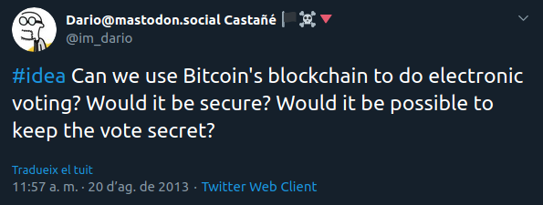]

---

- Backend Go developer: Loyal Guru
- Divulgador: [speakerdeck.com/dario](https://speakerdeck.com/dario)
- Blockchain Catalunya

---

# ¿Qué es blockchain?

1. Base de datos (la más lenta del mundo*)
2. Registro distribuido
3. Cadena de bloques

_*: tiene una explicación._

---

## ¿Por qué es lenta?

Cambiamos velocidad por:

- descentralización
- immutabilidad
- auditoría
- no es necesario confiar en terceros

???

- Pensad en Napster, eMule, Bittorrent, etc.

---

# Antes de ir al meollo, ¿para qué sirve?

- Pagos y transferencias
- Rastreo de mercancías
- Sistemas de recompensas
- Identidad digital
- Voto digital
- Certificación
- Tokenizar bienes y recursos
- ...

---

# ¿Cómo funciona?

- Elementos claves:
  - Huella o hash
  - Prueba of X (trabajo, participación, quemado, etc)
  - Criptografía asimétrica: transacciones

---

## Funciones de huella o hash

.center[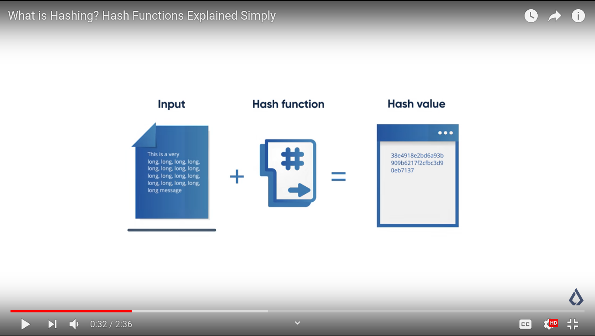]

---

## Prueba de X

.center[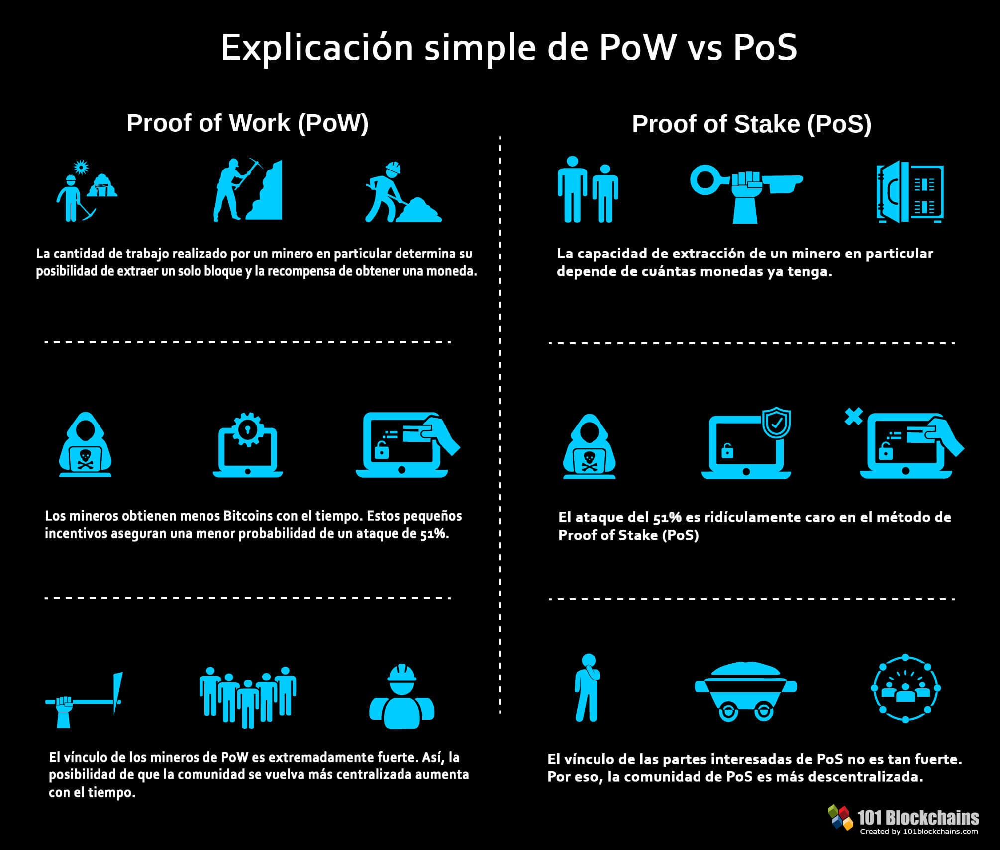]

???

- Stake o participación
- Lo usará Ethereum a medio plazo.

---

.center[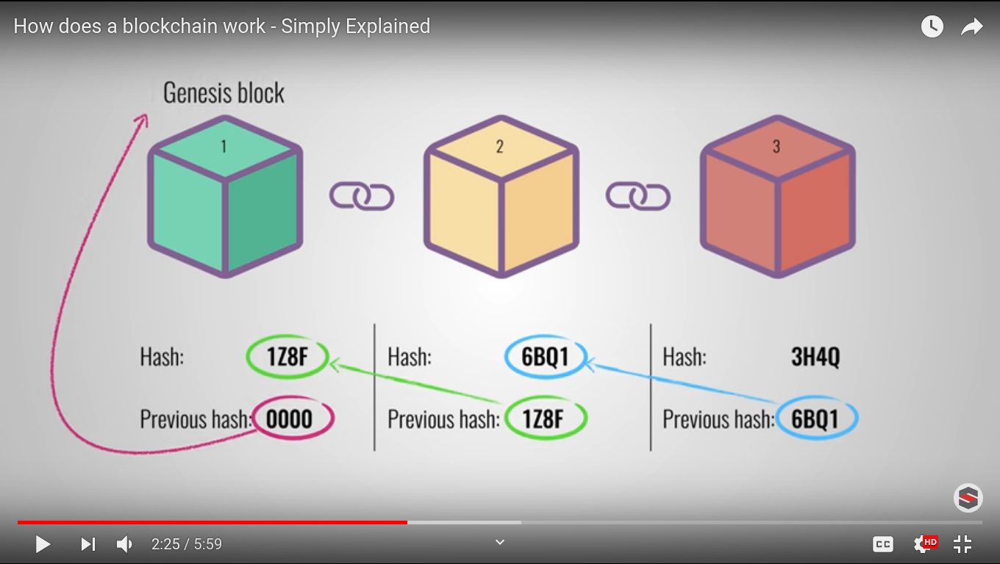]

???

- Bloques formados por:
  - Datos
  - Huella del bloque anterior
  - Huella de los datos más la huella del anterior
- Consenso emergente vía "proof of X"

---

## Criptografia de clave asimétrica

.center[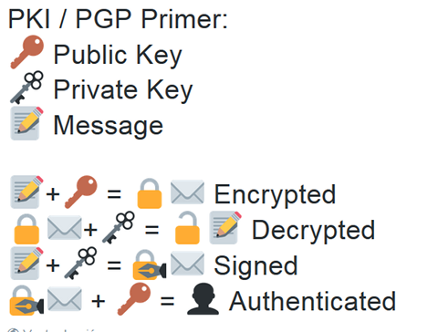]

---

# It's full of st... projects!

.center[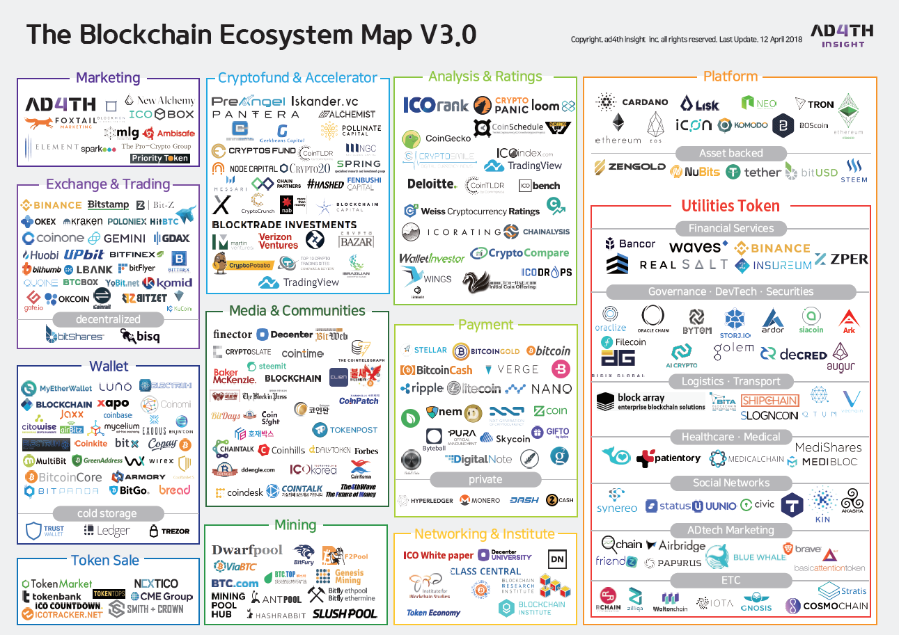]

---

.center[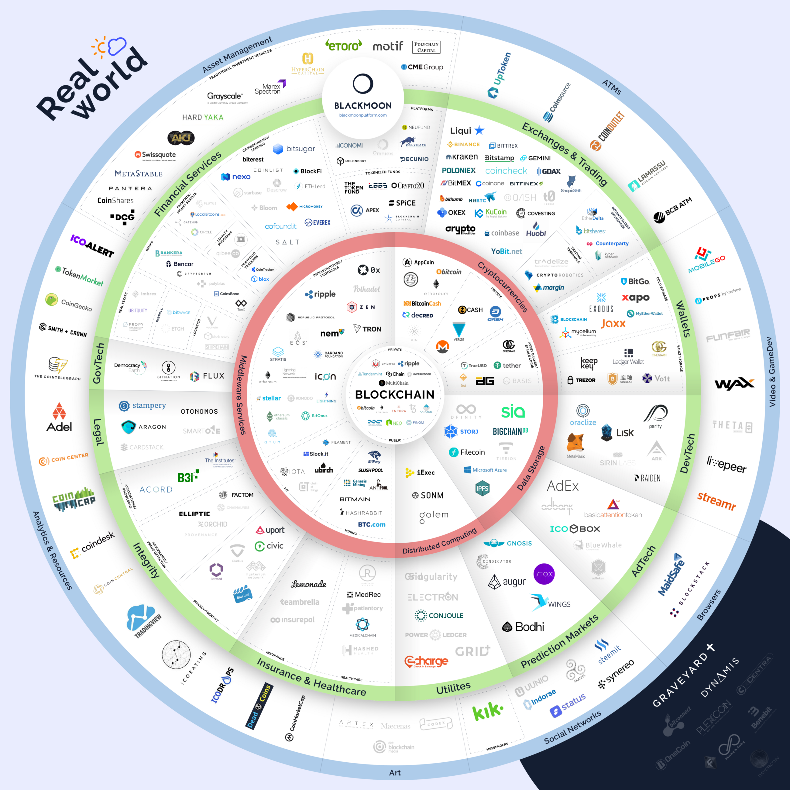]

---

.center[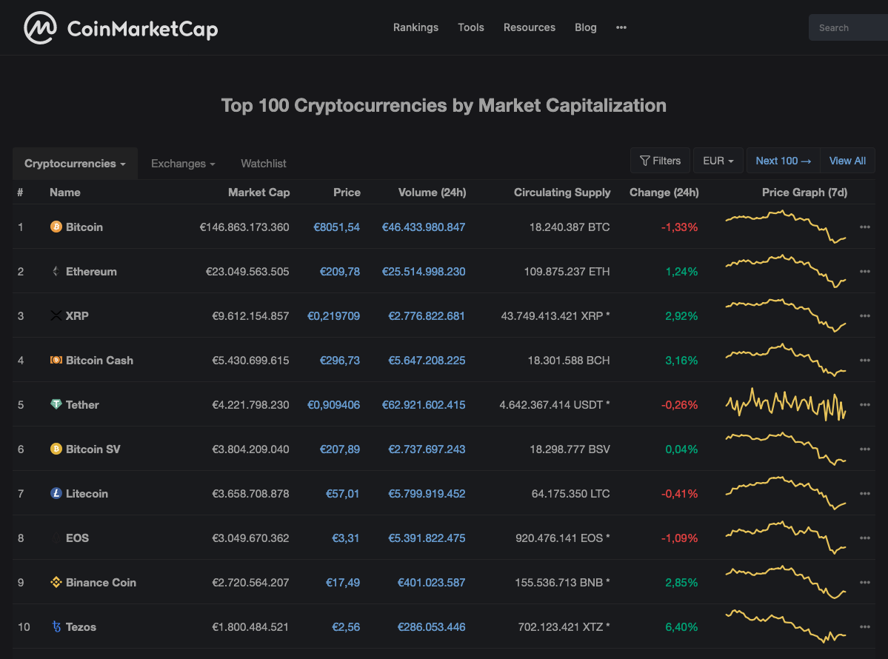]

---

.center[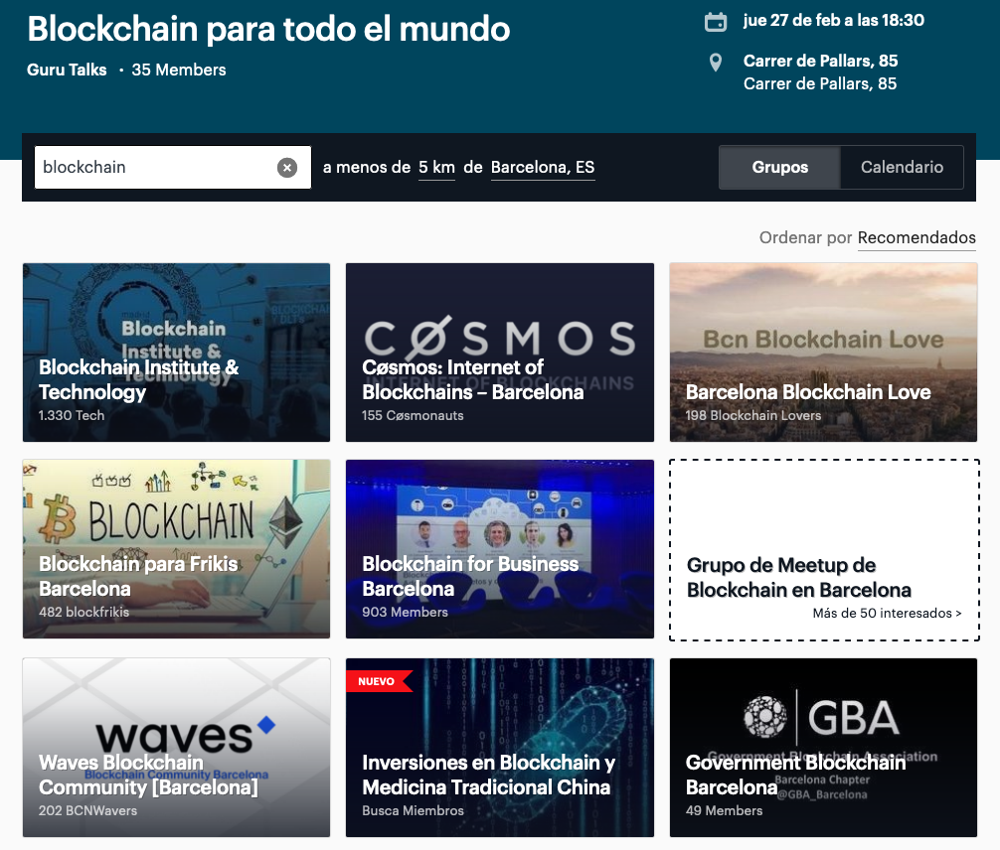]

---

.center[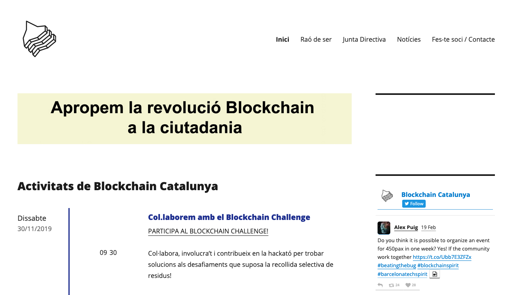]

---

.center[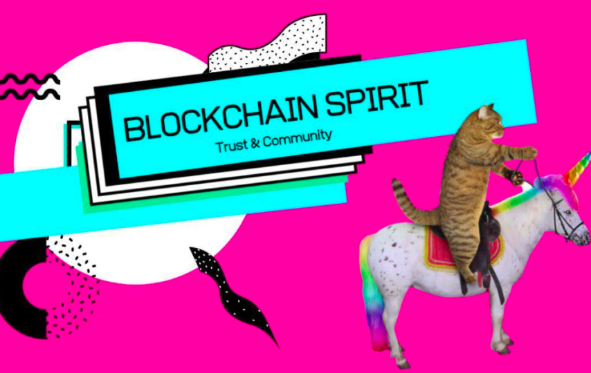]

---

# Recursos adicionales

- Binance Academy: [binance.vision/es](https://www.binance.vision/es/)
- Coinbase Learn: [coinbase.com/learn](https://www.coinbase.com/learn)

---

# ¿APM? ¡Gracias!

- {{email}}
- speakerdeck.com/dario
- twitter.com/@im_dario
- @dario@mastodon.social
- github.com/imdario
- keybase.io/dario
