title: Introduction to Cloud computing
class: animation-fade
layout: true
author: Dario Castañé
email: dcastane@loyal.guru
organization: Loyal Guru

<!-- This slide will serve as the base layout for all your slides -->
.bottom-bar[
  {{title}}
]

---

class: impact

# {{title}}
## {{author}}

---

# Dario Castañé

.center[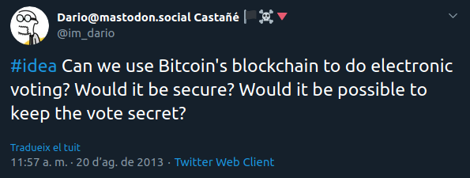]

---

# About me

- Tech Lead @ .alt[Loyal Guru]
- Board member @ .alt[Blockchain Catalunya]
- Contributor @ .alt[Go & Docker ecosystem]
- Speaker @ [.alt[speakerdeck.com/dario]](https://speakerdeck.com/dario)

---

# 1/3: Cloud

- What
- Where
- Why
- Who

---

## What is the cloud?

.center[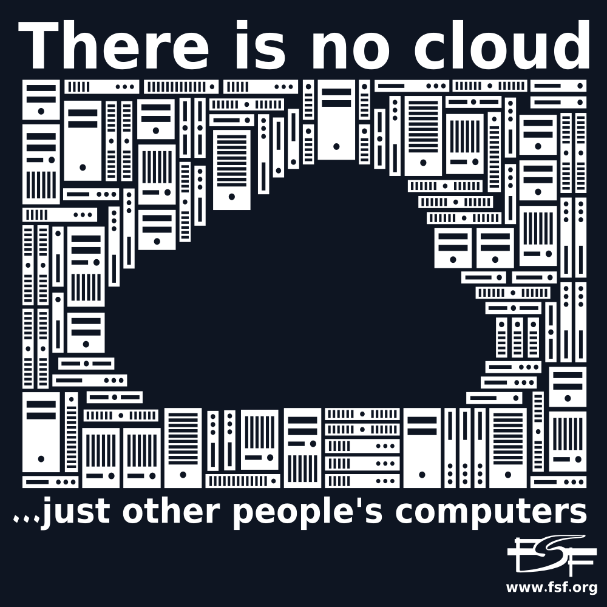]

---

.center[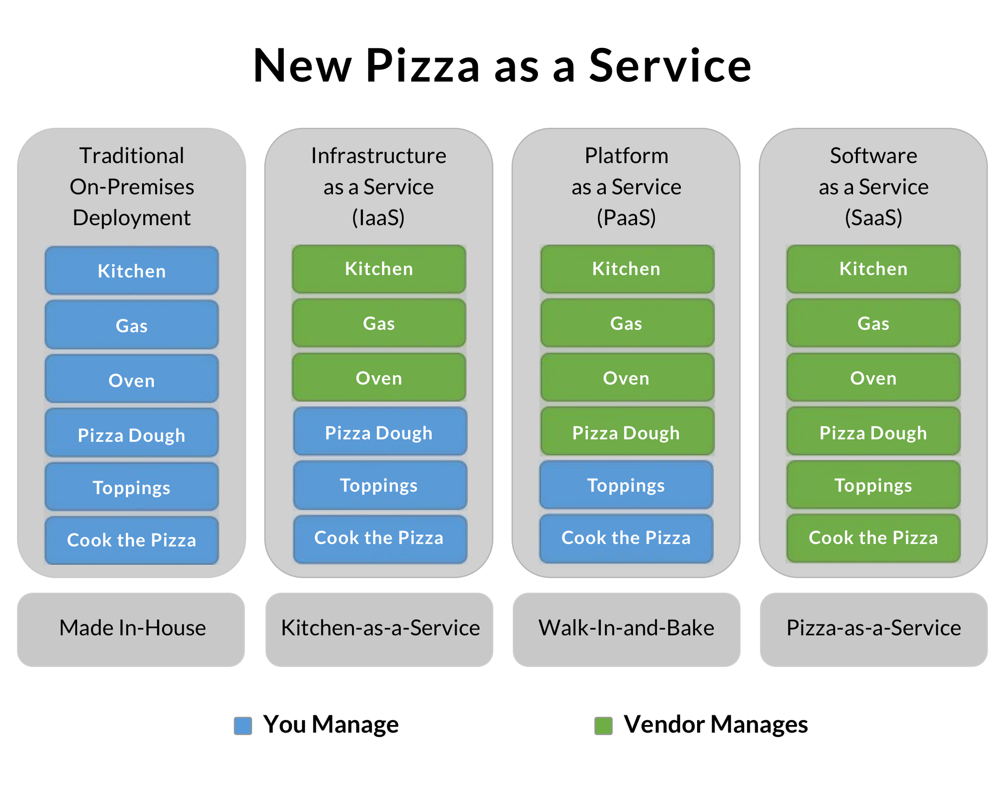]

---

.center[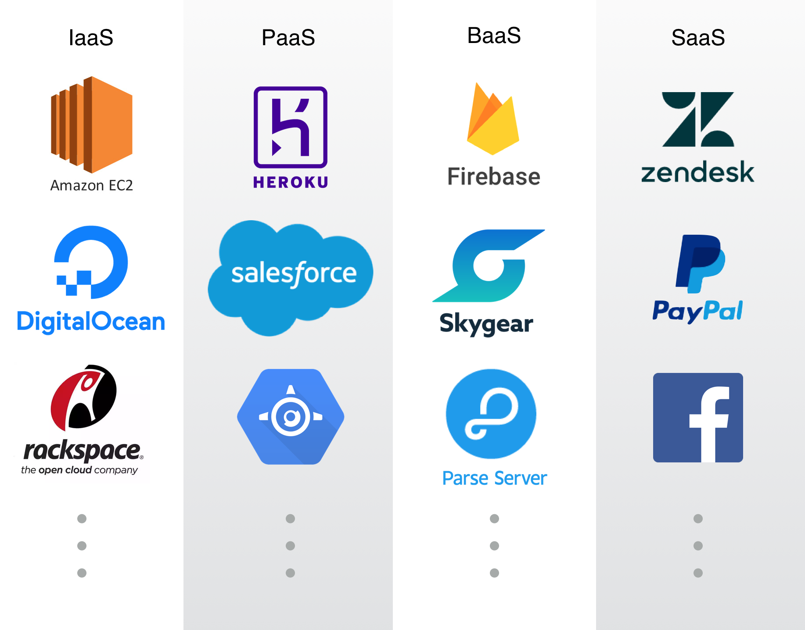]

???

- BaaS: Backend-as-a-Service (evolved PaaS)

---

## Where is it?

.center[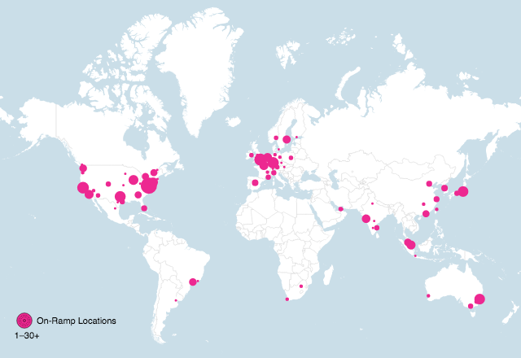]

???

- Datacenters (physical)
  - AWS: 61 datacenters + 155 edge location datacenters
- Different uses: hosting, CDN, edge computing...

---

## Why use it?

- Cost and deployment time reduction
- Ubiquitous access
- Pay per use, no upfront payments (if you don't want)
- Always up-to-date technology
- (Almost) unlimited storage
- Security
- Fairness

---

## Who is the cloud?

- Amazon Web Services
- Google Cloud Platform 
- Microsoft Azure

???

- Three big players dominate the IaaS & PaaS space
- They are also big players in the SaaS space
  - AWS: Amazon
  - Google: Gmail, Google Docs, etc.
  - Azure: Skype, Hotmail, etc.

---

.center[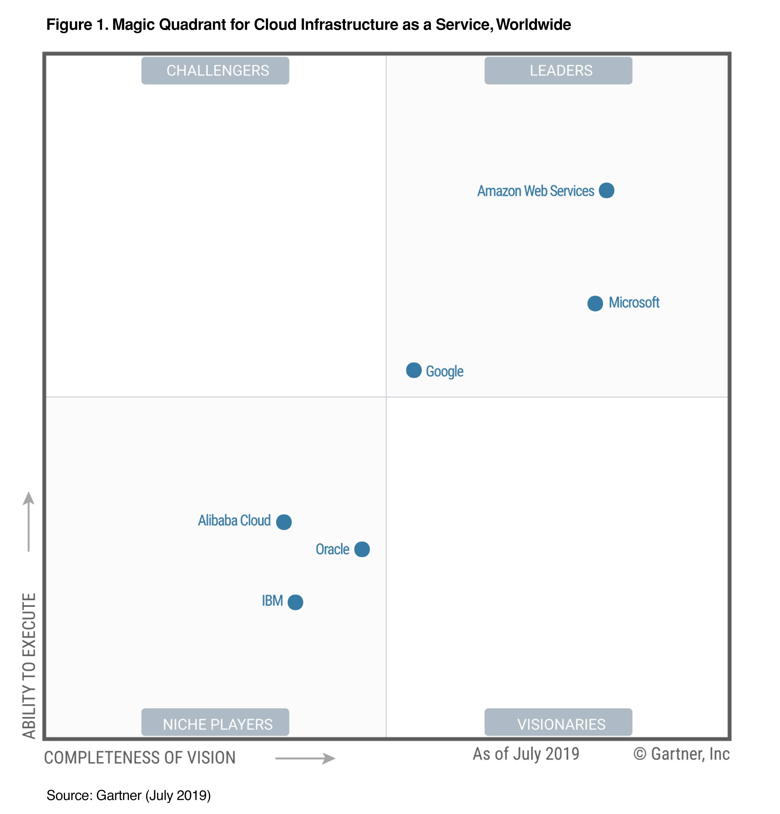]

???

- Gartner Magic Quadrant for Cloud Infrastructure as a Service

---

### Google Cloud Platform

.center[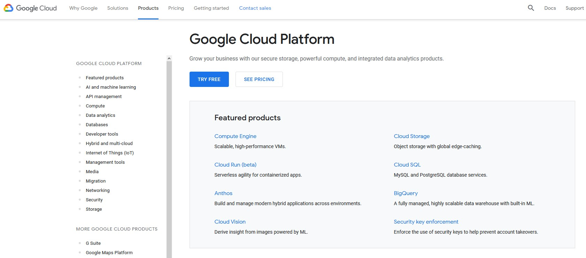]

???

- Data Analytics
- Big Data
- Business Intelligence

---

### Microsoft Azure

.center[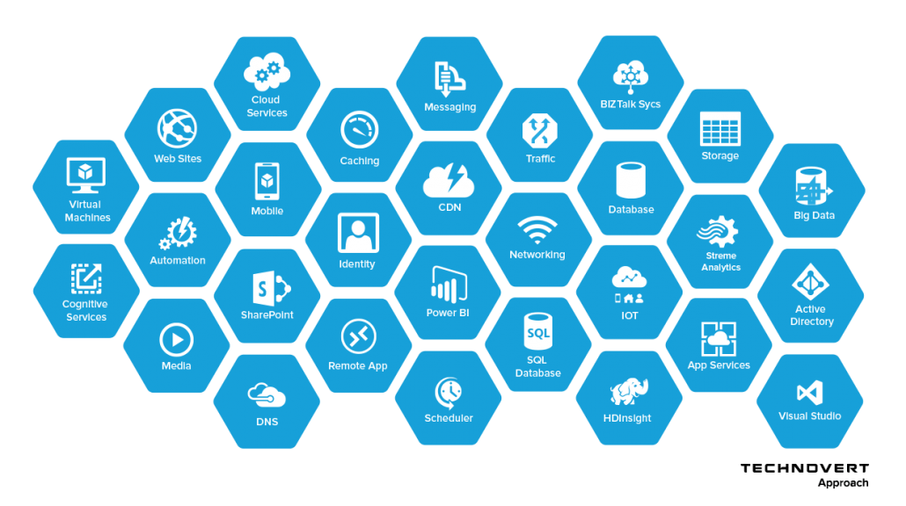]

???

- PowerBI

---

### Amazon Web Services (AWS) I

.center[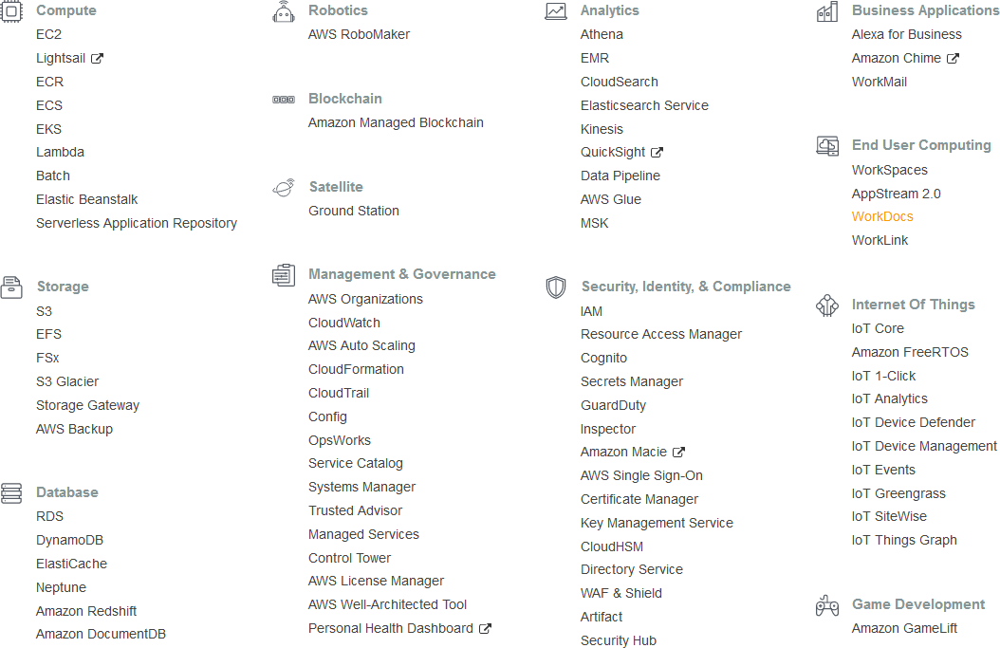]

---

### Amazon Web Services (AWS) II

.center[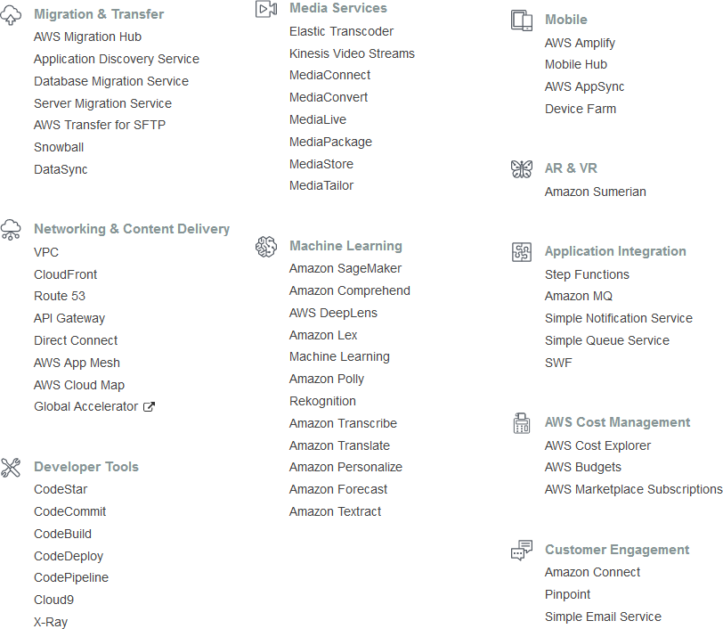]

???

- Examples based on AWS

---

## Services categories

.row[
  .col-3[
- AI + Deep/Machine Learning
- AR & VR / Mixed Reality
- Blockchain
- Business Applications
  ]
  .col-3[
- Compute
- Database
- Data analytics
- Developer Tools
  ]
  .col-3[
- End User Computing
- Internet of Things
- Management & Governance / DevOps
- Networking & Content Delivery
  ]
  .col-3[
- Media Services
- Security, Identity & Compliance
- Storage
  ]
]

---

### AI + Deep/Machine Learning

- .alt[Amazon Comprehend (Medical):] NLP service to understand text. Useful for extract information from scientific papers.
- .alt[Rekognition + SageMaker:] machine learning services. I.e. to de-identify medical images.

???

- Comprehend: natural language processing (NLP) service that uses machine learning to find insights and relationships in text.
- Rekognition: deep learning-based visual analysis service.
- SageMaker: fully-managed service that covers the entire machine learning workflow to label and prepare your data, train, tune and optimize and use it.

---

### AR & VR / Mixed Reality

- .alt[Amazon Sumerian:] set of tools to develop AR and VR experiencies, like VR medical simulations.

???

- Sumerian: set of tools for creating high-quality virtual reality (VR) experiences on the web.

---

### Business Applications

-  .alt[Alexa:] voice assistant, like a assistant for emergency communications.
-  .alt[Amazon Chime:] communications service, for medical remote assistance, i.e.

???

- Alexa for Business is a service that enables organizations and employees to use Alexa to get more work done.
- Amazon Chime is a communications service that lets you meet, chat, and place business calls inside and outside your organization, all using a single application. 

---

### And the usual stuff

- .alt[Compute:] resizable servers, serverless applications, etc.
- .alt[Storage:] file and block storage and backup
- .alt[Database:] relational databases, key-value storage, etc.
- .alt[Data analytics:] Bussiness Intelligence, data mining, etc.
- .alt[Management & Governance / DevOps:] monitoring, deployments, automated scaling, etc.
- .alt[Security, Identity & Compliance:] cryptographic key management, user access control, etc.

???

- Compute: EC2, Lambda, ...
- Storage: S3 (PACS), Glacier (backup), Elastic Block Storage (hard drive), ...
- Database: DynamoDB, RDS, Redshift, ...
- Data analytics: Kinesis (real-time analysis), Quicksight (BI), Elastic Map Reduce, ...
- Management & Governance / DevOps: CloudWatch, CloudFormation, ...
- Security, Identity & Compliance: KMS, Cognito, etc.

---

## Multi-cloud solutions

- Use your favourite solutions among different providers.
- The sky is the limit!

???

- Google Cloud Computing is the most multi-cloud friendly.

---

# 2/3: Beyond the cloud: .alt[IoT and Blockchain]

---

# Internet of Things

- .alt[Smart] objects: connected and autonomous devices

.center[]

???

- Unique identified devices that can transfer data without human nor computer interaction.
- Also, this data can be processed and mined to get better decisions (or track everything).
- Applications: home, elder care, medical and healthcare, transportation, manufacturing, energy management, military, etc.
- Technologies: NFC (Near-field communications), RFID (Radio-frequency identification), Bluetooth (mesh networking), Wi-Fi (Chromecast, automated setup), 5G, etc.

---

## Internet of Medical Things (IoMT)

- Application of the IoT for medical and health related purposes, data collection and analysis for research, and monitoring
- .alt[Possibilities:]
  - Remote health monitoring
  - Emergency notification systems
  - Smart equipment

???

- Monitoring with specialized sensors
- Smart beds that can detect when they are occupied and when a patient is attempting to get up

---

# Blockchain

---

## What is the blockchain?

- First: (the slowest*) database
- Second: distributed ledger
- Third: chain of blocks

_*: there is a reason for this._

---

### Features (or why is it slow?)

We trade off speed for:

- Decentralization
- Immutability
- Trustlessness

???

- P2P: Napster, eMule, Bittorrent...

---

### How does it work?

- (Chain of) Blocks:
  - .alt[Data]: i.e. transactions
  - .alt[Hash:] Proof of Work (high computational cost)
  - .alt[Asymetric key cryptography:] identity (encryption and signatures)
- .alt[The result:] an emergent consensus

???

- There are other Proof of X: stake, burn, etc. The core idea is that nobody can take over everybody else.

---

background-image: url(hash.png)

---

background-image: url(blockchain.png)

---

## Where is it?

.center[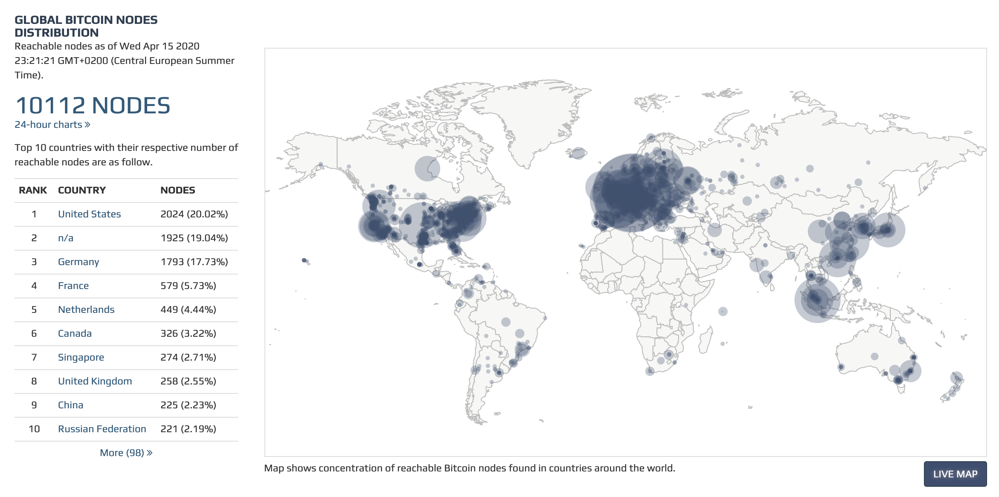]

---

## Why use it?

- Traceable
- No trusted third parties
- No central authority
- Cryptographically secure and immutable
- .alt[Remember:] don't store everything in there!

---

## Who is the blockchain?

.center[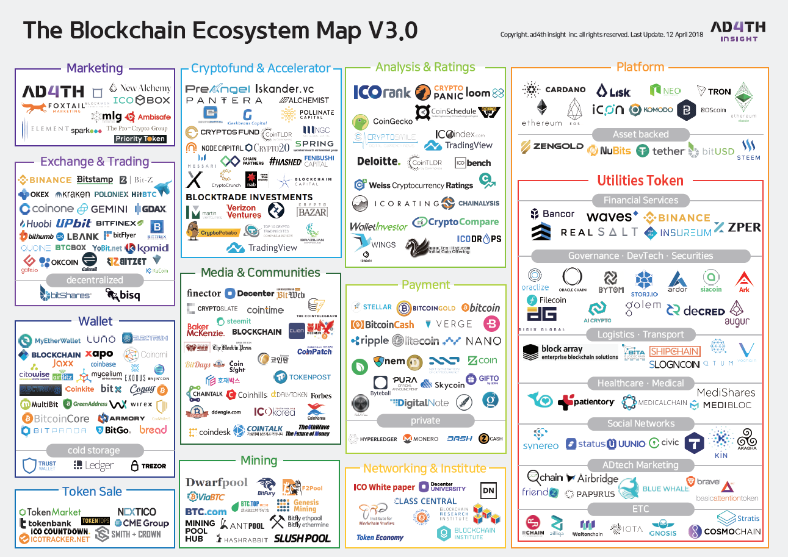]

---

background-image: url(blockchain-ecosystem-2.png)

---

## How can be used it?

- Value transfer: .alt[Bitcoin]
- Notary and smart contracts
- Real Estate (and any physicial object): .alt[tokenization]
- Distributed computing and storage
- Digital identity
- Electronic voting
- Healthcare - Medical
- Gambling
- ...

---

### Medical applications

- Temperature-Controlled transport monitoring
- Health records storage and management: .alt[Medibloc, Medicalchain & Patientory]
- Mutual Aid Marketplace: .alt[MediShares]

---

## Wait... Smart contracts?

- .alt[DApps:] Distributed apps
- Stored in the blockchain, so they are:
 - Immutable
 - Distributed

???

- They are small programs stored in a blockchain
- Distributed: the result is validated by all participants in the blockchain
- Example: Trustless Kickstarter (when the limit date is reached, the money goes to the creators if goal is met or to the supporters if not)
- Platform: Ethereum and Solidity

---

## I need a blockchain!

- Not so fast...
- Use this: [brucemacd.github.io/You-Dont-Need-A-Blockchain/](https://brucemacd.github.io/You-Dont-Need-A-Blockchain/)

---

# 3/3: Practicum

## a: Hello World - Our first smart contract

[https://studio.ethereum.org/](https://studio.ethereum.org/)

---

# 3/3: Practicum

## b: CryptoPizza - Unique tokens

[https://studio.ethereum.org/](https://studio.ethereum.org/)

---

# 3/3: Practicum

## c: Our own X-Road - Tying up

.center[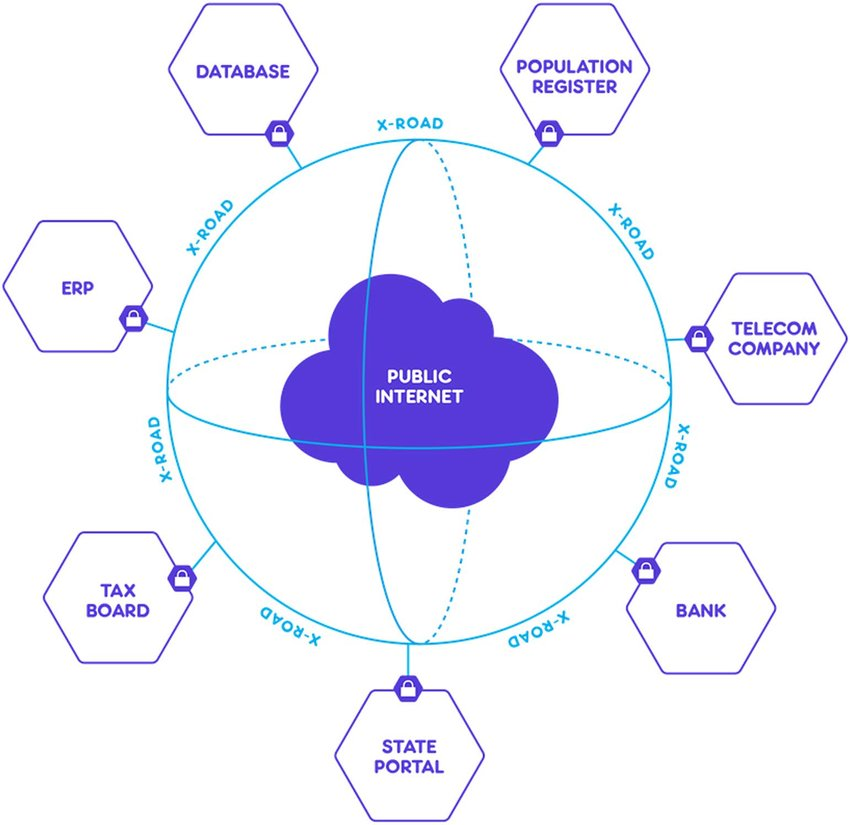]

???

- Cloud: storage of medical information and access control list
- Blockchain: smart contract to transfer unique tokens that are registered in the ACL
- Benefits:
  - Nobody can hijack the tokens (unless direct access to the wallet)
  - Nobody can do phishing (smart contracts have an unique verifiable address)
  - Nobody can access the data (unless they have a registered token in a wallet that can also prove their ownership - asymetric key crypto FTW)

---

# Thank you! Q&A time!

- {{email}}
- speakerdeck.com/dario
- twitter.com/darccio
- @dario@mastodon.social
- github.com/darccio
- keybase.io/dario

Slides: [github.com/darccio/talks](https://github.com/darccio/talks)
