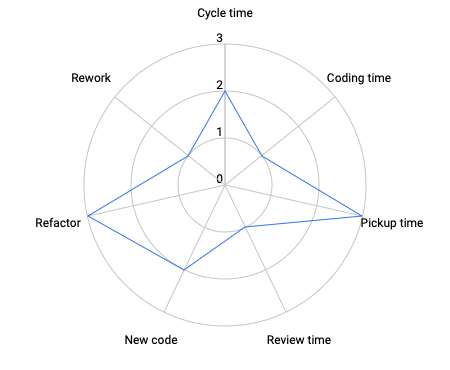

title: Performance Review
class: animation-fade
layout: true
organization: Loyal Guru
reviewee: Alejandro Pérez
period: S2 2021

.bottom-bar[
  {{title}}: {{period}} | {{reviewee}} @ {{organization}}
]

---

class: impact

# {{title}}: {{period}}
## {{reviewee}} (nivel 6)

---

# 📈 Estadísticas 

---

# 🌟 Momentos estelares

- Demostrado capacidad para liderar y gestionar el equipo.
- Mejorado en múltiples métricas DORA.
- Excelente feedback de los compañeros.
- Proactividad notable.

---

# 🚦 Farolillos rojos

- QA notes y code reviews mejorables.
- LinkMobility: exceso de rework y hotfixes.

---

# 🎯 Próximo quarter

- Aumentar el nivel de rework: reducir el número de hotfixes.
- Aumentar la implicación en los code reviews.
- Más esfuerzo en QA notes.
- Bienvenido al [nivel senior](https://docs.google.com/spreadsheets/d/10dhGxXIPaW4BmRofcwsK8MF2eIVB6XzSElouNnrp6tY/edit#gid=1493600589) 🎉
