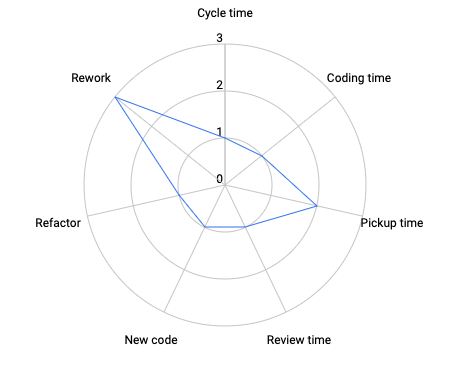

title: Performance Review
class: animation-fade
layout: true
organization: Loyal Guru
reviewee: Christian González
period: S2 2021

.bottom-bar[
  {{title}}: {{period}} | {{reviewee}} @ {{organization}}
]

---

class: impact

# {{title}}: {{period}}
## {{reviewee}} (nivel 3)

---

# 📈 Estadísticas 

---

# 🌟 Momentos estelares

- Alto impacto en casi todos los proyectos.
- Gran esfuerzo en POCs.
- Mejora notable en la gestión de la frustración.

---

# 🚦 Farolillos rojos

- QA notes y code reviews mejorables.
- Cycle time con tendencia a aumentar.
- Tests poco exhaustivos.

---

# 🎯 Próximo quarter

- Aumentar la implicación en los code reviews.
- Más esfuerzo en QA notes.
- Mejorar el cycle time.
- Aumentar la cobertura de tests.
