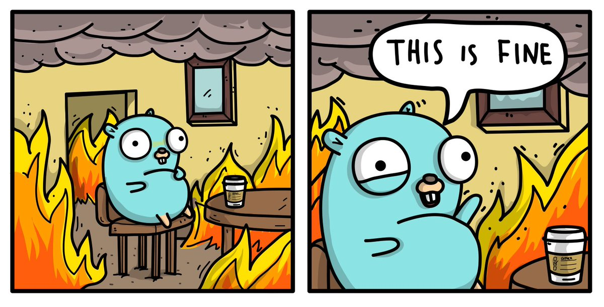
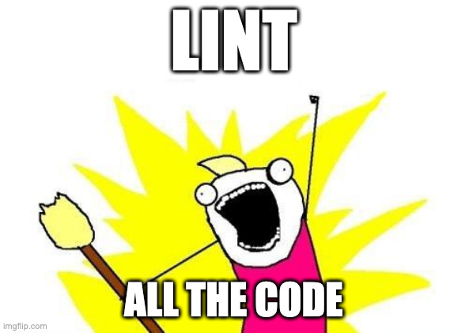

title: Toss a Linter to your Go source code
class: animation-fade
layout: true
author: Dario Castañé
email: dcastane@loyal.guru
organization: Loyal Guru
event: Tech Talks
date: 2020-03-06

.bottom-bar[
  {{title}} | {{author}} @ {{organization}} : {{event}} | {{date}}
]

---

class: impact

# {{title}}
## {{author}}

---

# What is a linter?

???

- Happy little tools to check our code for:
  - Bad and smelly code
  - Security errors
  - Non-idiomatic code
  - A single code style
  - Like Rubocop!
- They help to have our heads cool as this little fella

---

---

# Are they worth it?

--

.center[]

???

- They help to:
  - Find bugs
  - Prevent production failures
  - Introduce best practices
- Working to comply to them is good:
  - Speeds up code reviews through automation
  - Issues are detected earlier
  - Everybody follows the same conventions
- They can be added to CI (pin its version)

---

# So, what's on the menu?

- go vet
- golangci-lint

More at [golangci/awesome-go-linters](https://github.com/golangci/awesome-go-linters)

???

- Linters and linters runners
- Demo time
- `--new-from-rev` to lint only from specific commit

---

# Thank you! Q&A time!

.center[]
