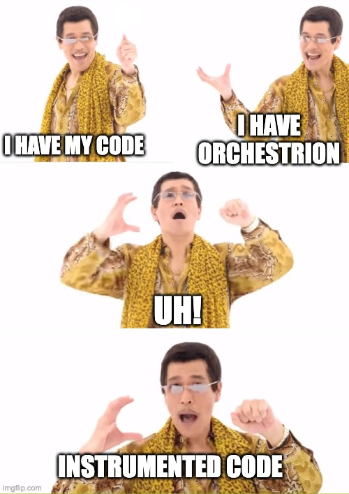

# Orchestrion: lightning demo

### Automatic compile-time instrumentation of Go code

Dario Castañé (he/him; github: darccio, bsky: dario.cat, fediverse&email: d@rio.hn)
GoLab 2024

<!--

Buon pomeriggio, bon dia, good afternoon, GoLand!

I'm Dario Castañé.

I work at DataDog as open source library maintainer for dd-trace-go, our Go SDK for APM, ASM, Profiling and other products.

Ok, quick show of hands. Anyone using Datadog?

In the next minutes, we'll go from a basic chi server without any dd-trace-go code to the exactly chi server without any dd-trace-go code BUT sending traces and profiles to DataDog.

How? We are going to use Orchestrion.

-->

---

# Orchestrion

[github.com/DataDog/orchestrion](github.com/DataDog/orchestrion)
[datadoghq.dev/orchestrion](https://datadoghq.dev/orchestrion/)

<!--
Orchestrion is a tool that transparently add Datadog instrumentation to your go applications to achieve maximum coverage for Application Performance Monitoring, Application Security Management and Profiling.

It works thanks to a go build flag called toolexec. That's the key for this to work.

It allows to control or modify how Go's toolchain programs get run.

With no further ado, let's dive in the code we are going to instrument.
-->

---

# The code

<!--
Simple chi server.

Let's set up Orchestrion.

cat go.mod
orchestrion pin
cat go.mod
-->

---

# Demo time!

- <a href="https://app.datadoghq.eu/apm/traces?query=%40_trace_root%3A1%20service%3Agolab2024&agg_m=count&agg_m_source=base&agg_t=count&cols=core_service%2Ccore_resource_name%2Clog_duration%2Clog_http.method%2Clog_http.status_code&fromUser=false&historicalData=false&messageDisplay=inline&query_translation_version=v0&serviceName=golab2024&sort=desc&spanType=trace-root&storage=hot&view=spans&paused=false" target="_blank">Tracing</a>
- <a href="https://app.datadoghq.eu/profiling/explorer?query=service%3Agolab2024%20&agg_m=count&agg_m_source=base&agg_t=count&fromUser=true&my_code=disabled&refresh_mode=paused&viz=flame_graph&live=true" target="_blank">Profiling</a>
- <a href="https://app.datadoghq.eu/logs/livetail?query=service%3Agolab2024&storage=live" target="_blank">Logging</a> (with the [Agent properly configured](https://docs.datadoghq.com/agent/logs/?tab=tcpudp#activate-log-collection))

<!--
Show it first empty, run and show it full.

To summarize, this is what just happened...
-->

---

<!-- Our code, Orchestrion, boom, observable service with no modifications! -->

---

# Do you want to know more?

Julio Guerra - GopherCon Europe 2021: [youtu.be/Uk1hscXhlY0](https://youtu.be/Uk1hscXhlY0)

Jon Bodner - GopherCon 2023: [youtu.be/5l-W7vPSbuc](https://youtu.be/5l-W7vPSbuc)

Me (again): bsky: dario.cat, fediverse&email: d@rio.hn

Orchestrion docs: [datadoghq.dev/orchestrion](https://datadoghq.dev/orchestrion/)

These slides: [github.com/darccio/talks/tree/main/go/orchestrion](https://github.com/darccio/talks/tree/main/go/orchestrion)

